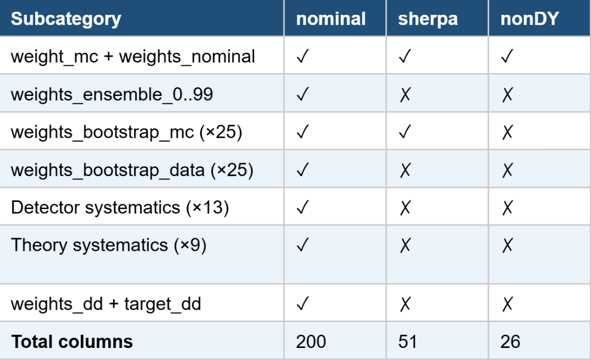

# What columns are present, and which are weights vs. observables vs. metadata? 
## column classification:
 Inspection of all three files reveals a shared observable structure but diverging weight schemas. The nominal file (multifold.h5) contains 418,014 events across 200 columns. The columns can be catagorized as follows:
 

## weights vs observables vs metadata:

 * The observables are the physical measurements per collision event which is in columns 0-23 and they are consistent in terminology accross all 3 files.
 * The weight structure differs significantly across the three files. They are further subcatagorized as follows:

 

 * No true metadata columns seem to be present in any of the files.
 * 'target_dd' (col 127) - This column contains float64 values ranging from ~0.000001 to ~0.061, with a mean of 0.004276, which is nearly identical in distribution to  weights_nominal column. It is impossible to confirm what data this column contains from the file alone and no other external documentation about it has been provided. It is also absent in the other two files (sherpa and nonDY).

# What information would a physicist need to reuse these weights that is not currently present in the files?
 While the nominal file contains 200 columns and 418,014 events, no provenance, context, or documentation is present in it. A physicist attempting to reuse these weights without prior knowledge of the analysis would face a lot of problems, such as:
 * No column labels: The columns are indexed by number (0-199) with no descriptive names or units. scientists cannot identify which columns correspond to which physical observables, weights, or systematic variations without external documentation.
 * No OmniFold training provenance: The number of training iterations, neural network architecture, input features used by the model, and convergence criteria are not stored. Independent reproduction or validation of the unfolding is not possible from the file alone.
 * No generator or simulation metadata: The distinction between the three files is invisible from their contents and a user cannot determine that sherpa used the Sherpa generator or that nonDY includes EW Zjj/VBF and diboson processes.
 * No file relationship metadata: The three files are related (they are systematic variations of the same measurement) but nothing inside the files encodes this relationship or their intended hierarchy using any standardized terminolgies.
 * No normalization or luminosity information: The integrated luminosity and cross-section normalization needed to compute absolute event rates are absent. The weights_nominal values (mean ~0.004, max ~0.076) have no interpretable physical unit without this context.
 * No description of systematic weight variations: The 22 systematic columns (cols 178–199) have suggestive names but no documentation of direction, magnitude, or the methodology used to derive them.

# What challenges do you anticipate in standardizing this kind of output across different experiments or analyses?

* Long-term model reproducibility: OmniFold relies on trained neural networks whose behavior depends on framework versions (TensorFlow, PyTorch) that evolve over time. Without storing model weights or a frozen software environment, reproducing results years later may be infeasible.
* Structurally inconsistent files within the same analysis: Even within this single dataset, the three files differ substantially in column count (200 vs. 51 vs. 26). The systematic variant files omit ensemble weights, bootstrap replicas, and all detector/theory systematics. No convention governs which weight types must appear in which files, making automated ingestion unreliable.
* Variable naming conventions differ across experiments: ATLAS, CMS, and LHCb use different naming schemes for the same physics quantities. A standard must either enforce a controlled vocabulary or provide an explicit mapping layer between experiment-specific and canonical names.
* Ensemble and bootstrap sizes are not fixed: This analysis seems to be using 100 ensemble members and 25 bootstrap replicas, but other analyses may use different counts. A schema must accommodate variable-length weight arrays without breaking downstream tools that assume fixed dimensions.
* No convention for co-locating data and MC events: Some analyses store data and MC in separate files; this dataset interleaves them without labeling. Without a standard convention, generic reweighting code cannot be written to work across both approaches.
* Systematic weight structure is analysis-specific: The set of applicable systematic variations differs by detector, analysis, and era. A general schema needs a flexible, self-describing mechanism for systematics rather than hardcoded column names.

